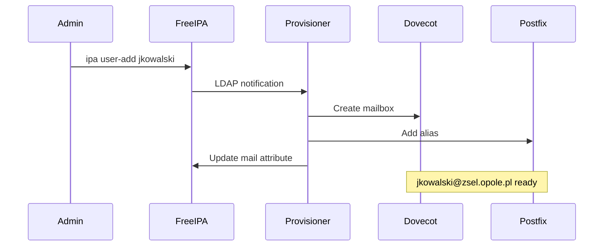
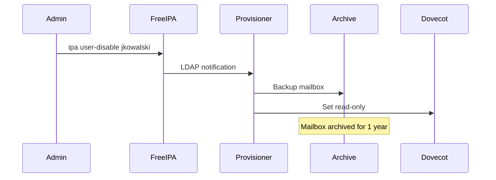

# 📧 ZSEL Mail Server

> **Serwer pocztowy** zintegrowany z FreeIPA (AD)  
> **Domena**: `@zsel.opole.pl`  
> **Automatyczne provisioning** przy tworzeniu użytkownika w AD

---

## 🎯 Funkcjonalności

1. **Auto-provisioning** - tworzenie skrzynki przy dodaniu usera do FreeIPA
2. **Auto-deprovisioning** - archiwizacja przy dezaktywacji
3. **LDAP authentication** - jedno hasło do wszystkiego
4. **Grupy dystrybucyjne** - automatyczne z OU
5. **Quota management** - limity per rola

---

## 🏗️ Architektura

```
┌─────────────────┐     ┌─────────────────┐     ┌─────────────────┐
│    FreeIPA      │────▶│   Mail Hooks    │────▶│    Postfix      │
│  (LDAP/Kerb)    │     │   (Python)      │     │    + Dovecot    │
└─────────────────┘     └─────────────────┘     └─────────────────┘
        │                       │                       │
        │                       │                       │
        ▼                       ▼                       ▼
┌─────────────────┐     ┌─────────────────┐     ┌─────────────────┐
│   User Create   │     │ Mailbox Create  │     │  IMAP/SMTP      │
│   User Delete   │     │ Mailbox Archive │     │  with LDAP      │
│   User Modify   │     │ Alias Update    │     │  auth           │
└─────────────────┘     └─────────────────┘     └─────────────────┘
```

---

## 📁 Struktura Repozytorium

```
zsel-mail-server/
├── README.md
├── docker-compose.yml           # Lokalny dev
├── kubernetes/
│   ├── namespace.yaml
│   ├── postfix-deployment.yaml
│   ├── dovecot-deployment.yaml
│   ├── provisioner-deployment.yaml
│   └── configmaps/
│       ├── postfix-main.cf
│       ├── dovecot.conf
│       └── ldap-config.yaml
├── provisioner/                 # Python hooks
│   ├── Dockerfile
│   ├── pyproject.toml
│   ├── src/
│   │   ├── __init__.py
│   │   ├── main.py
│   │   ├── freeipa_listener.py
│   │   ├── mailbox_manager.py
│   │   └── config.py
│   └── tests/
├── ansible/
│   ├── mail-provisioning.yml
│   └── roles/
│       └── mailbox/
└── docs/
    ├── architecture.md
    └── troubleshooting.md
```

---

## 🔄 Flow: User Lifecycle

### 1. Nowy użytkownik (Onboarding)



### 2. Dezaktywacja (Absolwent/Skreślenie)



---

## 📧 Konfiguracja Email

### Adresy per rola

| Rola | Format Email | Quota |
|------|--------------|-------|
| Uczeń | `{login}@zsel.opole.pl` | 1 GB |
| Nauczyciel | `{imie}.{nazwisko}@zsel.opole.pl` | 5 GB |
| Administracja | `{imie}.{nazwisko}@zsel.opole.pl` | 10 GB |
| Dyrekcja | `{imie}.{nazwisko}@zsel.opole.pl` | 20 GB |

### Aliasy grupowe

| Grupa | Alias | Członkowie |
|-------|-------|------------|
| Klasa 1TI | `klasa-1ti-2026@zsel.opole.pl` | Auto z OU |
| Nauczyciele | `nauczyciele@zsel.opole.pl` | Auto z OU |
| Rada pedagogiczna | `rada@zsel.opole.pl` | Ręczne |
| Dyrekcja | `dyrekcja@zsel.opole.pl` | Ręczne |

---

## ⚙️ Provisioner Service

### Konfiguracja

```yaml
# config.yaml
freeipa:
  server: ipa1.zsel.opole.pl
  base_dn: dc=zsel,dc=opole,dc=pl
  bind_dn: uid=mail-provisioner,cn=sysaccounts,cn=etc,dc=zsel,dc=opole,dc=pl
  watch_ous:
    - ou=uczniowie
    - ou=nauczyciele
    - ou=administracja

mail:
  domain: zsel.opole.pl
  maildir_base: /var/mail/vhosts
  
quota:
  default: 1073741824  # 1 GB
  nauczyciel: 5368709120  # 5 GB
  admin: 10737418240  # 10 GB

archive:
  path: /archive/mail
  retention_days: 365
```

### Event Handlers

```python
# provisioner/src/freeipa_listener.py

from ldap3 import Server, Connection, SUBTREE
import asyncio

class FreeIPAListener:
    """Nasłuchuje zmian w FreeIPA przez LDAP persistent search."""
    
    async def on_user_add(self, user_dn: str, attributes: dict):
        """Wywołane przy dodaniu użytkownika."""
        uid = attributes['uid'][0]
        role = self._detect_role(user_dn)
        
        # Utwórz skrzynkę
        email = await self.mailbox_manager.create_mailbox(
            uid=uid,
            quota=self._get_quota(role)
        )
        
        # Zaktualizuj FreeIPA
        await self.freeipa.update_mail_attribute(uid, email)
        
    async def on_user_disable(self, user_dn: str, attributes: dict):
        """Wywołane przy dezaktywacji użytkownika."""
        uid = attributes['uid'][0]
        
        # Archiwizuj i ustaw read-only
        await self.mailbox_manager.archive_mailbox(uid)
        
    async def on_user_delete(self, user_dn: str, attributes: dict):
        """Wywołane przy usunięciu (permanentnym)."""
        uid = attributes['uid'][0]
        
        # Finalna archiwizacja
        await self.mailbox_manager.final_archive(uid)
```

---

## 🚀 Deployment

### Kubernetes

```bash
# Deploy mail server stack
kubectl apply -f kubernetes/namespace.yaml
kubectl apply -f kubernetes/configmaps/
kubectl apply -f kubernetes/

# Verify
kubectl get pods -n mail-server
```

### Ansible (one-time provisioning)

```bash
# Bulk provision existing users
ansible-playbook -i inventory/production \
  mail-provisioning.yml \
  -e "action=bulk_create" \
  -e "source=freeipa"
```

---

## 🔐 Bezpieczeństwo

### LDAP Bind Account

```bash
# Utwórz service account w FreeIPA
ipa service-add mail-provisioner/mail.zsel.opole.pl

# Przypisz uprawnienia
ipa privilege-add "Mail Provisioner"
ipa privilege-add-permission "Mail Provisioner" \
  --permissions="System: Read User Standard Attributes"
ipa privilege-add-permission "Mail Provisioner" \
  --permissions="System: Modify User mail Attribute"
```

### TLS/SSL

- Postfix: TLS required (STARTTLS)
- Dovecot: TLS required (IMAPS 993, POPS 995)
- LDAP: LDAPS (636) lub STARTTLS

---

## 📊 Integracja z Ekosystemem

```
┌─────────────────────────────────────────────────────────────┐
│                    ZSEL Ecosystem                           │
├─────────────────────────────────────────────────────────────┤
│                                                             │
│  ┌─────────┐    ┌─────────┐    ┌─────────┐    ┌─────────┐  │
│  │ Vulcan  │───▶│ Airflow │───▶│ FreeIPA │───▶│  Mail   │  │
│  │  (SIO)  │    │  (ETL)  │    │  (AD)   │    │ Server  │  │
│  └─────────┘    └─────────┘    └────┬────┘    └─────────┘  │
│                                     │                       │
│                    ┌────────────────┼────────────────┐      │
│                    │                │                │      │
│               ┌────▼────┐    ┌─────▼─────┐    ┌─────▼────┐ │
│               │ Moodle  │    │ Nextcloud │    │TechBuddy │ │
│               │  (LMS)  │    │  (Files)  │    │   (AI)   │ │
│               └─────────┘    └───────────┘    └──────────┘ │
│                                                             │
└─────────────────────────────────────────────────────────────┘
```

---

## 📋 Roadmap

- [x] Podstawowa struktura repo
- [ ] Postfix + Dovecot deployment
- [ ] LDAP provisioner
- [ ] Auto-aliasy grupowe
- [ ] Webmail (Roundcube/SOGo)
- [ ] Mobile sync (ActiveSync)
- [ ] Spam filtering (Rspamd)
- [ ] DKIM/SPF/DMARC

---

**Ostatnia aktualizacja**: 2026-01-15
